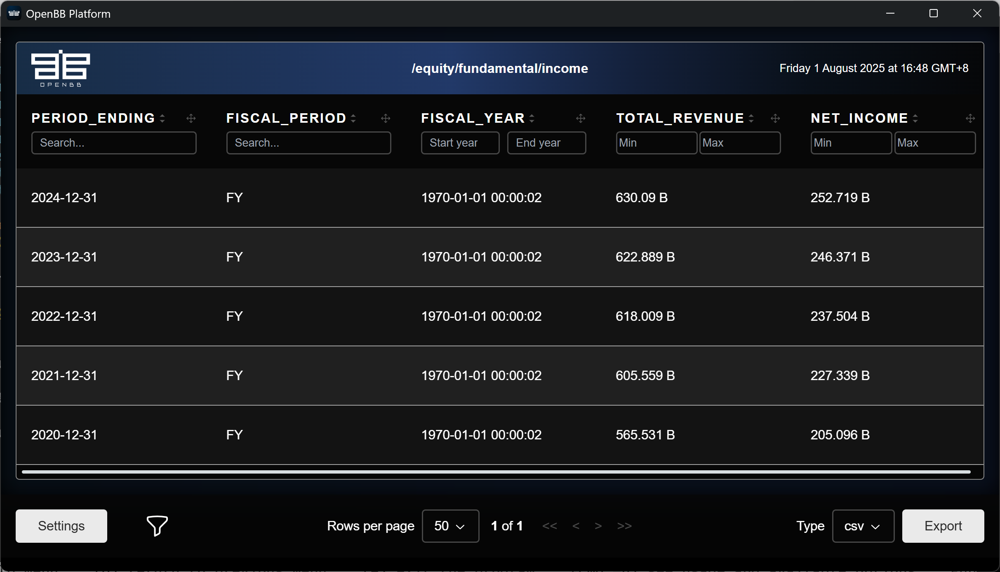

# How to Use Tushare as a Data Source for OpenBB

**OpenBB**, as an open-source financial data platform, is dedicated to providing free and transparent financial data interfaces for investors, analysts, and developers. For a detailed introduction to OpenBB and its usage, please refer to [Introduction to OpenBB and How to Use It to Aid Financial Data Analysis of China A-share and Hong Kong Stocks](https://medium.com/@shugaoye/introduction-to-openbb-and-how-to-use-it-to-aid-financial-data-analysis-of-china-a-share-and-hong-f4bbe480399a).

Although OpenBB supports multi-source data interfaces, the acquisition of financial data in China (including Hong Kong) mainly relies on Yahoo Finance. As a free basic data source, it can meet basic needs, but its coverage depth for the Chinese and Hong Kong markets is still insufficient. More importantly, mainland Chinese users need to use a VPN to access this service, creating significant usage barriers.

To query A-share and Hong Kong stock data, OpenBB urgently needs to improve the access to localized financial data sources. For A-share and Hong Kong stock data, the mainstream paid solutions include Wind, Eastmoney Choice, and 同花顺 iFind (mainly for institutional clients); while the open-source data sources mainly use Tushare or AKShare as alternatives.​

As two important financial data tools, Tushare and AKShare have their own distinct characteristics. To clearly show the differences between them, the following table systematically compares and summarizes the two.

| Feature                | Tushare                                                                        | AKShare                                                          |
| ---------------------- | ------------------------------------------------------------------------------ | ---------------------------------------------------------------- |
| Is it free?            | The free version has limited functions, and advanced functions require points. | Completely free                                                  |
| Data quality           | High, standardized                                                             | Medium, dependent on the source website, and needs to be cleaned |
| Data coverage          | Wide, with an emphasis on A-shares and macro data                              | Very wide, including cryptocurrencies, overseas markets, etc.    |
| Interface stability    | High (Pro API)                                                                 | Medium (affected by the source website)                          |
| Document integrity     | High, detailed                                                                 | Medium, and some parts require looking at the source code        |
| Community activity     | High, mature                                                                   | High, with fast updates                                          |
| Learning cost          | Low                                                                            | Low to medium                                                    |
| Suitable users         | Enterprises, professional researchers                                          | Students, individual developers, beginners                       |
| Real-time data support | Supported (requires advanced permissions)                                      | Partially supported, dependent on the source website             |
| Maintenance model      | Individually led                                                               | Community-driven                                                 |

Currently, there are two independent projects that have respectively developed OpenBB data source extensions for Tushare and AKShare.

**Tushare**: https://github.com/finanalyzer/openbb_tushare

**AKShare**: https://github.com/finanalyzer/openbb_akshare

This article mainly describes how to use Tushare as the data source for OpenBB. For information on how to use AKShare as the data source for OpenBB, please refer to the article [How to Use AKShare as a Data Source for OpenBB](https://medium.com/@shugaoye/how-to-use-akshare-as-a-data-source-for-openbb-f5dedc0d673b). The `openbb_tushare` project, as a data source extension for OpenBB, enables the seamless integration of Tushare data into the OpenBB platform.

## 💻 Environment Setup and Installation Process

As developers, we primarily interact with the platform through the OpenBB Platform CLI. To integrate the Tushare data source, follow these steps to configure the development environment:

1. **Create a Python Virtual Environment**

   You can use `venv`, `uv`, or `poetry` to create a virtual environment. Here, we use venv (built into Python):

   ```bash
   # Create a virtual environment  
   python3 -m venv .venv  
   
   # Activate the virtual environment (Linux/Mac)  
   source .venv/bin/activate  
   
   # For Windows  
   .venv\Scripts\activate  
   ```

2. **Install OpenBB Platform CLI**

   Install the core OpenBB CLI via pip. Users in mainland China can configure a mirror for faster installation:

   ```bash
   # (Optional) Set a domestic mirror for pip  
   # For Linux/Mac  
   export PIP_INDEX_URL=https://mirrors.aliyun.com/pypi/simple 
   
   # Install OpenBB CLI
   pip install openbb-cli
   ```

3. **Install openbb_tushare**

   Next, install the `openbb_tushare` extenstion to use the Tushare data source:

   ```bash
   # Install the Tushare data source extension  
   pip install openbb_tushare  
   
   # Rebuild OpenBB resources to activate the plugin  
   python -c "import openbb; openbb.build()"  
   ```

## 🔧Configuration of Tushare Token

Since Tushare requires a token to access its data source, you need to complete the token configuration before using it. The token for the data source supports the following two configuration methods:

1.  Configuration via OpenBB Hub

2.  Local environment configuration

For the specific operation process, please refer to the official documentation: https://docs.openbb.co/platform/settings/user_settings/api_keys

This article briefly explains the method of configuring the Tushare token in the local environment: OpenBB's user preference settings and tokens are stored in the local path `~/.openbb_platform/`, and saved in the `user_settings.json` file in JSON format. An example is as follows:

```JSON
{
  "credentials": {
    "fmp_api_key": "REPLACE",
    "tushare_api_key": "REPLACE"
  }
}
```

Add your own Tushare token to this file to access Tushare's data interface.

## 🚀 Using the Tushare Data Source

Next, we will take obtaining stock historical data and financial data as examples to describe the actual application process of using the Tushare data source. The same functions will be demonstrated using Jupyter Notebook and OpenBB CLI respectively.

### Check the installation and version of the Tushare extension

Before actual use, we can first confirm the installation and configuration of the environment.

```Python
from openbb import obb

obj = obb.reference["info"]["extensions"]["openbb_provider_extension"]
modules = [item for item in obj if "tushare" in item]
modules.append([item for item in obj if "akshare" in item][0])
print(modules)
```

Output:

```
['openbb_tushare@0.2.4', 'openbb_akshare@0.4.46']
```

As mentioned above, the code has successfully verified the version configuration of the `openbb_tushare` and `openbb_akshare` extensions. After confirming that the environment is correct, you can use the OpenBB platform and the Tushare data source to retrieve data.

### Obtaining stock historical data (using Bank of China as an example)

As mentioned earlier, access to the Tushare data source through OpenBB can be achieved via both Python scripts and OpenBB CLI. The Python code example will run in the Jupyter Notebook environment, and the command-line operations will be executed on the Windows system.

**Obtaining stock historical data in Jupyter Notebook**

```Python
import pandas as pd

symbol = "601988.SH"
tickers = {"601988.SH": "Bank of China", "601006.SH": "Daqin Railway Co., Ltd."}
start = "2025-06-01"
end = "2025-07-31"
data = obb.equity.price.historical(symbol=symbol, start_date=start, end_date=end, 
                                   provider="tushare")
daily = data.to_dataframe()
daily.index = pd.to_datetime(daily.index)  # Convert index to datetime
daily.head()
```

Output:

```
	open	high	low	close	volume	amount	change	change_percent	pre_close
date									
2025-06-03	5.49	5.54	5.45	5.52	3290209.80	1807538.711	0.00	0.0000	5.52
2025-06-04	5.51	5.52	5.49	5.50	1653467.01	909604.517	-0.02	-0.3623	5.52
2025-06-05	5.50	5.51	5.46	5.47	2606604.23	1426854.477	-0.03	-0.5455	5.50
2025-06-06	5.47	5.49	5.43	5.45	2649578.38	1443638.857	-0.02	-0.3656	5.47
2025-06-09	5.44	5.46	5.41	5.43	2512503.43	1361861.754	-0.02	-0.3670	5.45
```

After executing the aforementioned code, the historical stock price data for the period from June 1, 2025 to July 31, 2025 has been successfully obtained. This dataset can be further visualized to generate a K-line chart, which is displayed as follows:

```Python
from openbb_demo import plot_candle
plot_candle(daily, title=tickers[symbol])
```


**Using OpenBB CLI to query historical stock prices**

If you need to repeat the aforementioned operation process in the OpenBB terminal, you can start the OpenBB command-line environment by executing the following command:

```PowerShell
C:\> openbb
```

After launching the OpenBB command-line environment, you can execute the following commands.

```
2025 Aug 01, 03:48 (🦋) /equity/price/ $ historical --symbol 601988.SH --start_date 2025-06-01 --end_date 2025-07-31 --
provider tushare
```

After executing this command, the OpenBB terminal will automatically render and output the results in the WebView, as shown in the following figure:


### Obtaining Stock Financial Data (taking Bank of China as an example)

**Using Jupyter Notebook to obtain Bank of China's financial data**

Fundamental analysis of stocks usually covers three core financial statements: income statement, balance sheet and cash flow statement.

To obtain the income statement data of Bank of China, the following code can be executed:

```Python
income_obj = obb.equity.fundamental.income(symbol=symbol, provider="tushare")
income_df = income_obj.to_dataframe()
income_df.head()
```

Output:

```
	period_ending	fiscal_period	fiscal_year	total_revenue	net_income
0	2024-12-31	FY	2024	6.300900e+11	2.527190e+11
1	2023-12-31	FY	2023	6.228890e+11	2.463710e+11
2	2022-12-31	FY	2022	6.180090e+11	2.375040e+11
3	2021-12-31	FY	2021	6.055590e+11	2.273390e+11
4	2020-12-31	FY	2020	5.655310e+11	2.050960e+11
```

This financial data can be further converted into a bar chart for visual display, as shown below:

```Python
income_df.plot(x='fiscal_year', y=['total_revenue', 'net_income'],
    kind='bar',
    figsize=(10, 5),
    title=tickers[symbol])
```


**Using OpenBB CLI to obtain Bank of China's financial data:**

Continue to obtain Bank of China's financial data through the OpenBB terminal.

```
2025 Aug 01, 04:47 (🦋) /equity/fundamental/ $ income --symbol 601988.SH --provider tushare
```

Its output results will be rendered in real time on the WebView interactive interface, as shown in the following figure:



## 🌟 openbb_tushare Project Ecosystem

The `openbb_tushare` project is currently in an active development phase, and contributions from the open-source community are welcome:

### Code Repositories

- **GitHub**: https://github.com/finanalyzer/openbb_tushare

- **GitCode**: https://gitcode.com/finanalyzer/openbb_tushare

### Ways to Contribute

1.  Submit Issues to report data needs or bugs.

2.  Contribute PRs to optimize data source interfaces.

3.  Improve documentation to help more users.

Through the integration of Tushare and OpenBB, users in China can more conveniently access real-time and historical data for markets such as A-Shares and Hong Kong Stocks, providing strong data support for quantitative analysis and investment research.