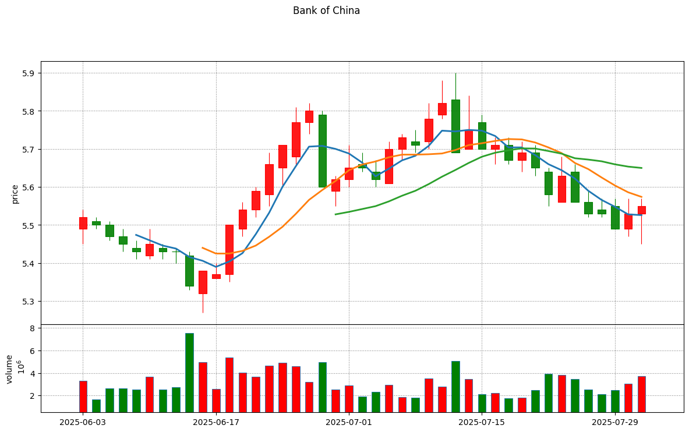
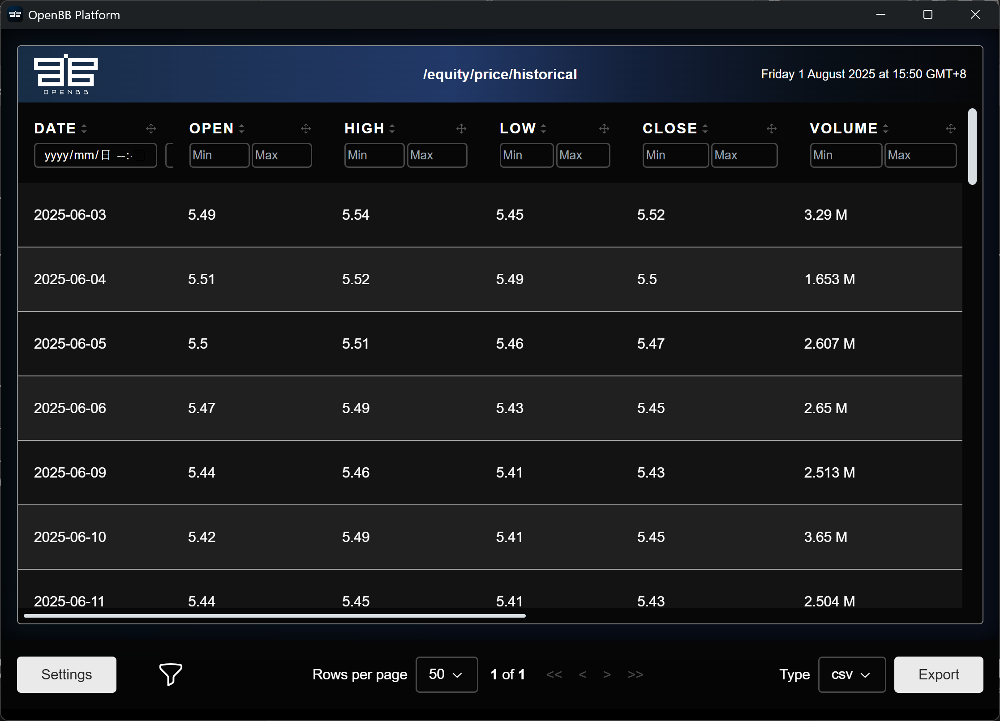
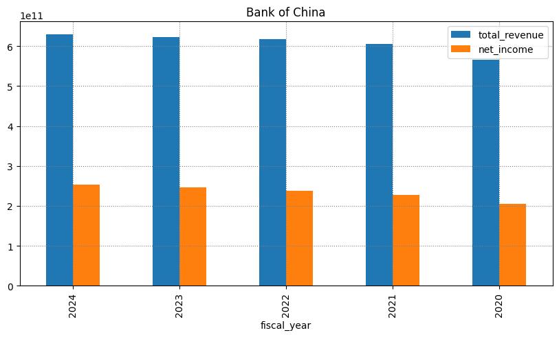
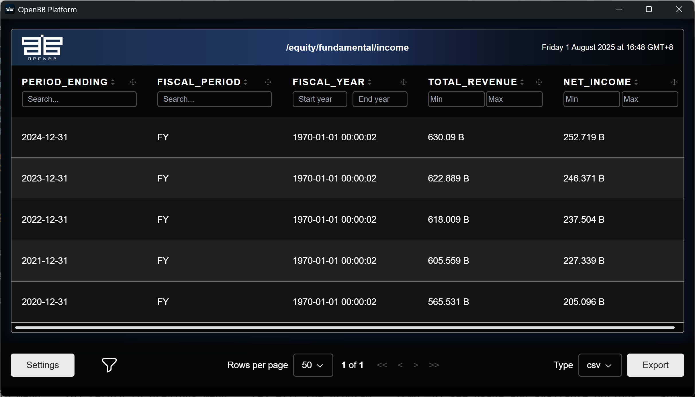

# Tushare对接OpenBB分析A股与港股市场

**OpenBB** 作为**开源金融数据平台**，致力于为投资者、分析师与开发者提供免费透明的金融数据接口。关于OpenBB的介绍以及如何使用，请参阅[OpenBB的介绍以及如何使用OpenBB助力A股港股的金融数据分析](https://blog.csdn.net/qq_29953771/article/details/148971007?fromshare=blogdetail&sharetype=blogdetail&sharerId=148971007&sharerefer=PC&sharesource=qq_29953771&sharefrom=from_link)。

OpenBB虽支持多个数据源，但中国区（含香港）金融数据获取主要依赖Yahoo Finance。该平台作为免费基础数据源虽能满足基本需求，但对中港市场的覆盖深度仍显不足。更关键的是，中国内地用户需借助VPN方可访问此服务，形成显著使用门槛。

要查询A股和港股数据，OpenBB亟待完善本地化金融数据源的接入。A股和港股数据，付费的主流方案包括Wind、东方财富Choice和同花顺iFind（主要面向机构客户）；开源数据源则以Tushare或AKShare为主要替代方案。

Tushare 与 AKShare 作为两款重要的金融数据工具，具备各自鲜明的特点。为清晰展示其差异，下表对二者进行了系统性的比较和总结。

| 特性     | Tushare         | AKShare       |
| ------ | --------------- | ------------- |
| 是否免费   | 免费版功能受限，高级功能需积分 | 完全免费          |
| 数据质量   | 高，标准化           | 中等，依赖源站，需清洗   |
| 数据覆盖范围 | 广，偏重A股和宏观       | 非常广，含加密货币、外盘等 |
| 接口稳定性  | 高（Pro API）      | 中等（受源站影响）     |
| 文档完整性  | 高，详细            | 中等，部分需看源码     |
| 社区活跃度  | 高，成熟            | 高，更新快         |
| 学习成本   | 低               | 低到中           |
| 适合用户   | 企业、专业研究者        | 学生、个人开发者、初学者  |
| 实时数据支持 | 支持（需高级权限）       | 部分支持，依赖源站     |
| 维护模式   | 个人主导            | 社区驱动          |

当前已有两个独立项目，分别开发了针对 Tushare 和 AKShare 的 OpenBB 数据源扩展。

- Tushare: https://github.com/finanalyzer/openbb_tushare

- AKShare: https://github.com/finanalyzer/openbb_akshare

本文主要讲述如何使用Tushare作为OpennBB数据源。如果要了解如何使用AKShare作为OpenBB数据源，请参阅文章[如何使用AKShare作为OpenBB的数据源](https://blog.csdn.net/qq_29953771/article/details/149118462)。`openbb_tushare`项目作为 OpenBB 的数据源扩展，可实现 Tushare 数据在 OpenBB 平台的无缝接入。

## 💻 环境搭建与安装流程

作为开发者，我们主要通过Python API接口和OpenBB Platform CLI与平台交互。要集成Tushare数据源，需按以下步骤配置开发环境：

1. 创建Python虚拟环境

   可以使用uv或者poetry来创建虚拟环境。在这里，我使用Python自带的组件venv来搭建虚拟环境。

   ```bash
   python3 -m venv .venv
   ```

   创建了虚拟环境后，可以用下面的命令使用这个虚拟环境。

   ```bash
   source .venv/bin/activate
   ```

   注：Windows系统执行`.venv\Scripts\activate`

2. 安装OpenBB Platform CLI

   在上面的虚拟环境中，我们需要先安装`openbb-cli`来使用OpenBB Platform CLI。

   ```bash
   pip install openbb-cli
   ```

   如果你在中国大陆，可以先设置下面的环境变量。这样可以使用阿里的镜像来加速安装过程。

   ```powershell
   set PIP_INDEX_URL=https://mirrors.aliyun.com/pypi/simple
   ```

3. 安装openbb_tushare

   接下来，我们需要安装`openbb_tushare`来使用Tushare数据源。

   ```bash
   pip install openbb_tushare
   ```

   安装`openbb_tushare`后，需要重新构建资源让安装生效。

   ```bash
   python -c "import openbb; openbb.build()"
   ```

## Tushare 令牌(token)的配置

由于 Tushare 要求使用 token 访问数据源，使用前需完成 token 配置。数据源的 token 支持以下两种配置方式：

1. 通过OpenBB Hub配置

2. 本地环境配置

具体操作流程请参阅官方文档：https://docs.openbb.co/platform/settings/user_settings/api_keys

本文简要说明在本地环境配置 Tushare token 的方法：OpenBB 的用户偏好设置及 token 均存储于本地路径 ~/.openbb_platform/，并以 JSON 格式保存于 user_settings.json 文件，示例如下：

```JSON
{
  "credentials": {
    "fmp_api_key": "REPLACE",
    "tushare_api_key": "REPLACE"
  }
}
```

在这个文件里添加自己的Tushare token来访问Tushare的数据接口。

## 🚀 使用 Tushare 数据源

接下来将通过获取股票历史数据与财务数据为例，来讲述使用 Tushare 数据源的实际应用流程。同样的功能将分别用Jupyter Notebook和OpenBB CLI来演示。

### 检查Tushare扩展的安装和版本

在实际使用之前，我们可以先确认一下环境的安装和配置情况。

```Python
from openbb import obb

obj = obb.reference["info"]["extensions"]["openbb_provider_extension"]
modules = [item for item in obj if "tushare" in item]
modules.append([item for item in obj if "akshare" in item][0])
print(modules)
```

输出:

```
['openbb_tushare@0.2.4', 'openbb_akshare@0.4.46']
```

如上所述，代码已成功验证 openbb_tushare 和 openbb_akshare 扩展的版本配置。环境检查无误后，即可启用 OpenBB 平台和 Tushare 数据源。

### 获取股票历史数据（以中国银行为例）

如前所述，通过 Python 脚本和OpenBB CLI均可通过 OpenBB 对 Tushare 数据源的访问。Python 代码示例将在 Jupyter Notebook 环境中运行，命令行操作则采用 Windows 系统执行。

#### Jupyter Notebook 获取股票历史数据

```Python
import pandas as pd

symbol = "601988.SH"
tickers = {"601988.SH": "Bank of China", "601006.SH": "Daqin Railway Co., Ltd."}
start = "2025-06-01"
end = "2025-07-31"
data = obb.equity.price.historical(symbol=symbol, start_date=start, end_date=end, 
                                   provider="tushare")
daily = data.to_dataframe()
daily.index = pd.to_datetime(daily.index)  # Convert index to datetime
daily.head()
```

执行结果：

```plaintext
	open	high	low	close	volume	amount	change	change_percent	pre_close
date									
2025-06-03	5.49	5.54	5.45	5.52	3290209.80	1807538.711	0.00	0.0000	5.52
2025-06-04	5.51	5.52	5.49	5.50	1653467.01	909604.517	-0.02	-0.3623	5.52
2025-06-05	5.50	5.51	5.46	5.47	2606604.23	1426854.477	-0.03	-0.5455	5.50
2025-06-06	5.47	5.49	5.43	5.45	2649578.38	1443638.857	-0.02	-0.3656	5.47
2025-06-09	5.44	5.46	5.41	5.43	2512503.43	1361861.754	-0.02	-0.3670	5.45
```

执行前述代码后，已成功获取 2025 年 6 月 1 日至 2025 年 7 月 31 日期间的历史股价数据。该数据集可进一步可视化生成 K 线图，展示如下：

```Python
from openbb_demo import plot_candle
plot_candle(daily, title=tickers[symbol])
```



#### 使用OpenBB CLI查询历史股价

若需在 OpenBB 终端重复前述操作流程，可通过执行以下命令启动 OpenBB 命令行环境：

```PowerShell
C:\> openbb
```

启动OpenBB命令行环境后，可以执行下面命令。

```bash
2025 Aug 01, 03:48 (🦋) /equity/price/ $ historical --symbol 601988.SH --start_date 2025-06-01 --end_date 2025-07-31 --
provider tushare
```

执行该命令后，OpenBB 终端将自动在 WebView 视图中渲染输出结果，如下图所示：



### 获取股票财务数据（以中国银行为例）

#### 使用Jupyter Notebook 获取中国银行财务数据

股票基本面分析通常涵盖三大核心财务报表：利润表、资产负债表及现金流量表。

获取中国银行（Bank of China）利润表数据可执行下述代码：

```Python
income_obj = obb.equity.fundamental.income(symbol=symbol, provider="tushare")
income_df = income_obj.to_dataframe()
income_df.head()
```

输出：

```
	period_ending	fiscal_period	fiscal_year	total_revenue	net_income
0	2024-12-31	FY	2024	6.300900e+11	2.527190e+11
1	2023-12-31	FY	2023	6.228890e+11	2.463710e+11
2	2022-12-31	FY	2022	6.180090e+11	2.375040e+11
3	2021-12-31	FY	2021	6.055590e+11	2.273390e+11
4	2020-12-31	FY	2020	5.655310e+11	2.050960e+11
```

该财务数据可进一步转化为柱状图进行可视化展示，如下所示：

```Python
income_df.plot(x='fiscal_year', y=['total_revenue', 'net_income'],
    kind='bar',
    figsize=(10, 5),
    title=tickers[symbol])
```



#### 使用OpenBB CLI获取中国银行财务数据:

继续通过 OpenBB 终端获取中国银行财务数据。

```
2025 Aug 01, 04:47 (🦋) /equity/fundamental/ $ income --symbol 601988.SH --provider tushare
```

其输出结果将实时渲染于 WebView 交互界面，如下图所示：



## 🌟 openbb_tushare 项目生态

目前`openbb_tushare`项目正处于活跃开发阶段，欢迎开源社区贡献力量：

**代码仓库**：

- GitHub：https://github.com/finanalyzer/openbb_tushare

- GitCode：https://gitcode.com/finanalyzer/openbb_tushare

**参与方式**：

1. 提交 Issue 反馈数据需求或 Bug

2. 贡献 PR 优化数据源接口

3. 完善文档帮助更多用户

通过 Tushare 与 OpenBB 的集成，中国区用户可更便捷地获取 A 股、港股等市场的实时与历史数据，为量化分析、投资研究提供强有力的数据支撑。